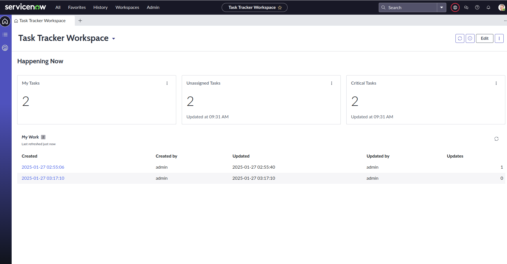

# Task Tracker Application

## Overview
The **Task Tracker** application is a simple tool for managing and tracking tasks. It was built using **ServiceNow App Engine Studio** and demonstrates basic application development skills, including table creation and workflow automation.

## Features
1. **Task Management**:
   - Add, view, and manage tasks using a centralized workspace.
   - Fields for tasks include:
     - Task Name
     - Description
     - Due Date
     - Status (Open, In Progress, Completed)

2. **Workflow Automation**:
   - A flow is set up to send email notifications whenever a new task is created.

4. **User-Friendly Interface**:
   - Designed using the ServiceNow Workspace for easy task management.

---

## Technical Details
### Development Environment
- **ServiceNow Personal Developer Instance (PDI)**
- **Tools Used**:
  - App Engine Studio
  - Flow Designer

### Data Model
- **Tasks Table**:
  - Fields:
    - `Task Name`: String
    - `Description`: Multi-line text
    - `Due Date`: Date/Time
    - `Status`: Choice (Open, In Progress, Completed)

### Workflow
- A flow was created using **Flow Designer**:
  - Trigger: When a new task is created.
  - Action: Send an email notification with dynamic content (Task Name, Description, Due Date, and Status).

---

## Screenshots
**Workspace**:

**Table**:

---

Built as part of a learning and experimenting application development using ServiceNow.
